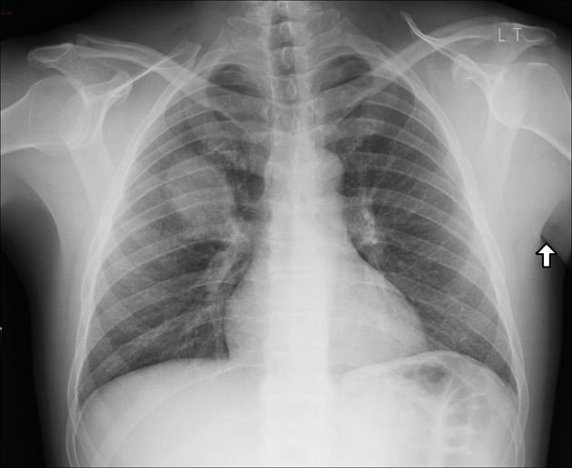
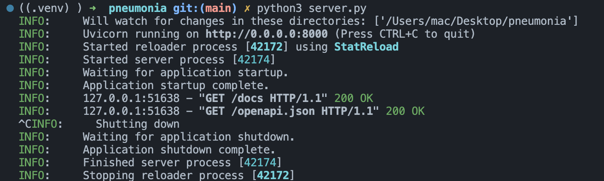
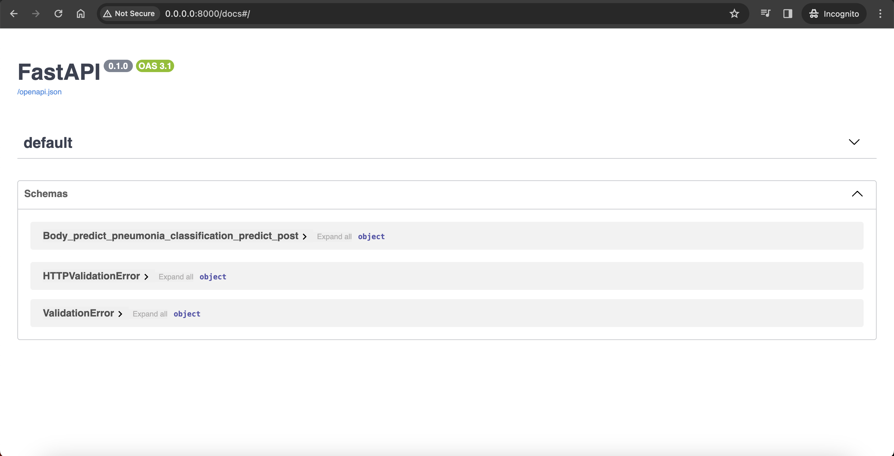
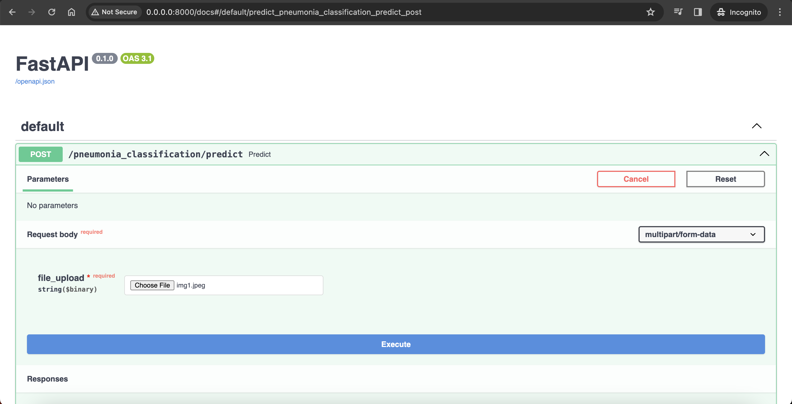
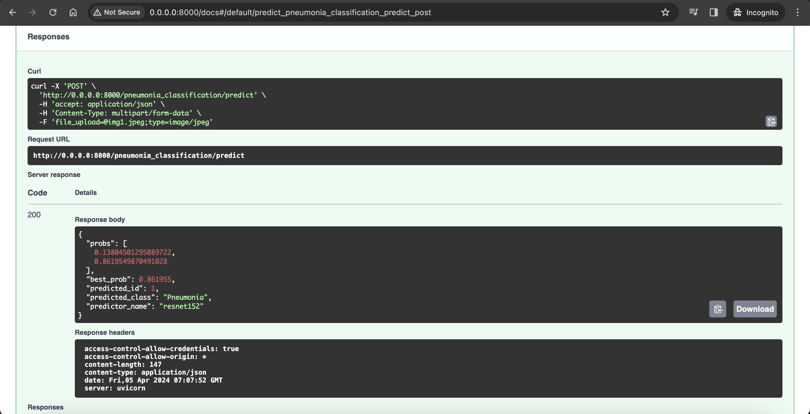
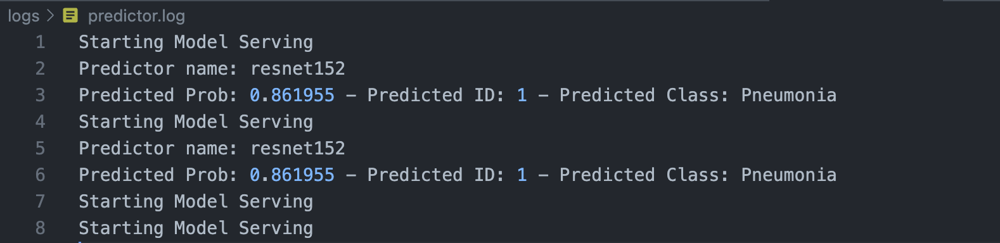

# Deploy Deep Learning Model with FastAPI
## Project Overview



Pneumonia is a severe lung infection that can be life-threatening if not diagnosed and treated promptly. Chest X-ray imaging plays a crucial role in the early detection and diagnosis of Pneumonia. However, interpreting these images accurately requires specialized knowledge and expertise. This project addresses this challenge by developing a deep learning model capable of analyzing chest X-ray images and classifying them as either showing signs of Pneumonia or being normal.

---

### Directory Structure
```
root/
├── config/
│   ├── pneumonia_cfg.py
│   └── logging_cfg.py
├── logs/
├── middleware/
│   ├── __init__.py
│   ├── cors.py
|   └── http.py
├── models/
│   ├── weights/
│   │   └── pneumonia_weights.pt
│   ├── dataset.py
│   ├── pneumonia_model.py
│   └── pneumonia_predictor.py
├── routes/
│   ├── base.py
│   └── pneumonia_route.py
├── schemas/
│   └── pneumonia_schema.py
├── utils/
│   └── logger.py
├── app.py
├── requirements.txt
└── server.py

```

---

### How to run?

Clone the project
```
$ git clone https://github.com/VuBacktracking/Deploy-Deep-Learning-Model-With-FastAPI.git
```

Install the requirements
```
$ pip install -r requirements.txt
```

Run the server.py
```
$ python3 server.py
```

Result


This will start the FastAPI application in development mode, and you can access the API at
`http://0.0.0.0:8000/docs`

---

### Demo






